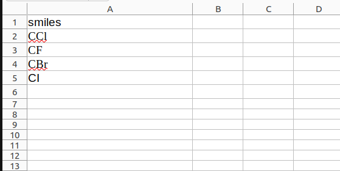
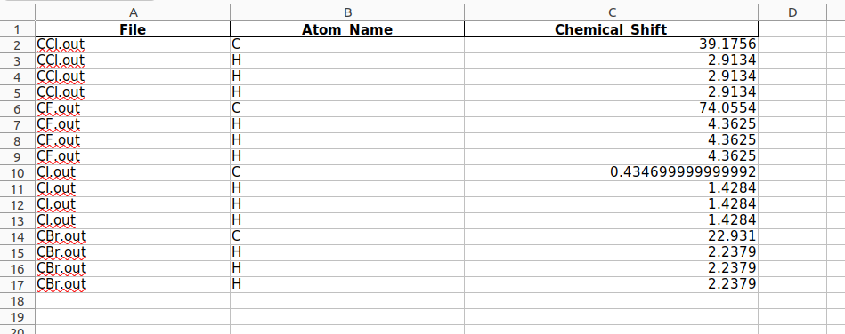

# AutoNMR - Streamlined NMR Chemical-Shifts via ISiCLE and NWChem
This repository aims to design and implement an automated workflow to streamline NMR chemical shift calculations using [NWChem](https://www.nwchem-sw.org/). It also involves developing a user-friendly Python API to define molecular systems and specify NMR parameters, simplifying the process and making it more efficient for researchers.

## Primary Objectives
- Design and implementation of an automated workflow that streamlines the process of NMR chemical shift calculations using [NWChem](https://www.nwchem-sw.org/)
- Development of a user-friendly [Python](https://www.python.org/) API (Application Programming Interface) for molecular system definition and NMR parameter specification

### What is NMR Chemical Shift ?
In NMR (Nuclear Magnetic Resonance) spectroscopy, chemical shifts denote the variations in the resonant frequency of a nucleus within a magnetic field, induced by its surrounding chemical environment. These variations arise from the shielding or deshielding effects exerted by the electron cloud around the nucleus. Local electron density variations, influenced by adjacent atoms or functional groups, modify the resonant frequency of the nucleus relative to a reference standard, typically tetramethylsilane (TMS) in organic solvents. This modification, quantified in parts per million (ppm), is termed the chemical shift. TMS, or (CH₃)₄Si, serves as the standard reference for chemical shifts, with δTMS defined as 0 ppm. Chemical shift measurements for ¹H nuclei in samples are referenced against the ¹H resonance of TMS. Grasping the trends in chemical shifts is essential for accurate NMR spectral interpretation. For more details you can visit here [Chemical Shift](https://chem.libretexts.org/Bookshelves/Organic_Chemistry/Organic_Chemistry_(Morsch_et_al.)/13%3A_Structure_Determination_-_Nuclear_Magnetic_Resonance_Spectroscopy/13.03%3A_Chemical_Shifts_in_H_NMR__Spectroscopy)

## Getting Started with NWChem
NWChem aims to provide its users with computational chemistry tools that are scalable both in their ability to treat large scientific computational chemistry problems efficiently, and in their use of available parallel computing resources from high-performance parallel supercomputers to conventional workstation clusters.

NWChem software can handle:

 - Biomolecules, nanostructures, and solid-state
 - From quantum to classical, and all combinations
 - Ground and excited-states
 - Gaussian basis functions or plane-waves
 - Scaling from one to thousands of processors
 - Properties and relativistic effects
   
NWChem consists of independent modules that perform the various functions of the code. Examples of modules include the input parser, SCF energy, SCF analytic gradient, DFT energy, etc.. For details about the NWChem you can visit the NWChem [Documentation Page](https://nwchemgit.github.io/Compiling-NWChem.html) here.

## Installation of NWChem on Linux OS
The following tutorial aims to downlaod the NWChem on Linux Operating System. For Windows and macOS you can visit the [NWChem website](https://nwchemgit.github.io/Download.html) for reference.
- Open the Terminal at home directory
- Update the package list by running the following command
  ```
  sudo apt update
  ```
- Install NWChem by running following command
  ```
  sudo apt install nwchem
  ```
- Now you have succesfully installed NWChem on your system.
## Running the Automated Python Script
In this tutorial we will discuss how to run the Automated Python Script [NWchem_Run.py](NWchem_run.py) available in this repository to generate the NMR Chemical Shifts of atoms present in the compound. Here are the steps you should follow to get the chemical shifts.

-  Step 1:
  Download the python script [NWchem_Run.py](NWchem_run.py) available in this repository in a folder in home directory ( say "raj" ).
  Navigate the terminal to the created directory ( here "raj" ). 
  
-  Step 2:
  Create a .xlsx ( Excel file ) in the same directory ( here "raj" )  containing all list of Canonical Smiles Code of Compound whose NMR Chemical Shift is to be calculated. The Sample file named    [smiles.xlsx](smiles.xlsx) is in this repository. The smiles.xlsx file is shown below.

- 

-  Step 3:
  Run the following command in terminal to get the output. Make sure to provide the .xlsx file containing smiles as a command line argument as shown below.
 ```
    python NWchem.py smiles.xlsx
 ```

  ## Output of the Python Script
  As soon as we run the python script in the terminal , the terminal begins to run the NWChem module for each of the smiles code provided in the smiles.xlsx list. Once the run is over, the output file     named output.xlsx is generated in the same directory ( here "raj"). The sample of the output file is present in this repository named [output.xlsx](output.xlsx).
  The content of the output file can be seen below.
  
  

  Here you can see it generates three columns, first column 'filename' tells about the smilecode of the file whose atom's chemical shift is generated. Second column tells about the atom name whose chemical shift is calculated and third column gives the information about the NMR Chemical shift value of the respective atom of the file.

  Note
  The reference compund taken here in these calculation is TMS whose chemical shift is found to be zero ppm
  
   ## Getting the Chemical Shift Plot
   In this section we will be generating the chemical shift plot from the output obatined using a python script Plot.py.

   In order to do this , run the python script Plot.py ( available in this repository ) in the terminal in the same directory where previous calculations where performed and provide the name of the output file ( here output.xlsx ) as a command line argument. 
   The command line for running the script is shown below
   ```
python Plot.py output.xlsx
```


  
